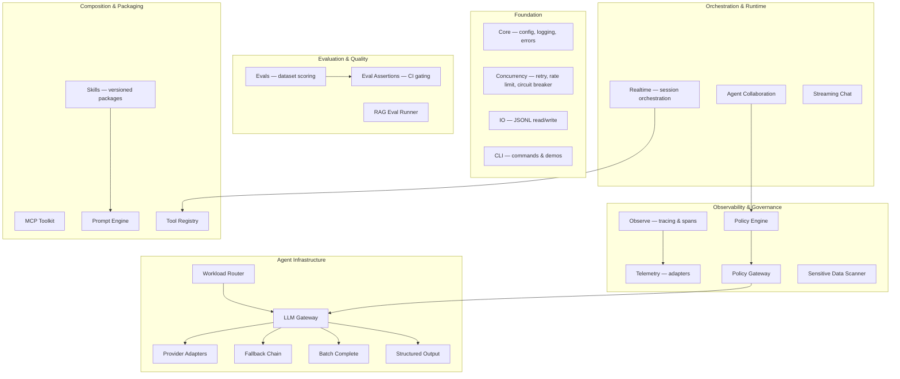

<p align="center">
  
</p>

# ElectriPy Studio

**The Python substrate for observable agent engineering.**

[](https://github.com/inference-stack-llc/electripy-studio/actions/workflows/ci.yml)
[](https://pypi.org/project/electripy-studio/)
[](https://github.com/inference-stack-llc/electripy-studio/releases/latest)
[](https://www.python.org/downloads/)
[](https://opensource.org/licenses/MIT)

## Overview

ElectriPy Studio is a curated collection of production-grade Python components for building observable, testable, and governable agent systems. It provides composable infrastructure for LLM routing, evaluation, policy enforcement, MCP integration, reusable skills packaging, realtime session orchestration, and telemetry-aware runtime execution — all without adopting a framework.

> **Use ElectriPy when you want typed, production-grade building blocks that compose into your architecture rather than a monolithic framework that owns it.**

## Why ElectriPy Studio

| Problem | What ElectriPy provides |
|---------|------------------------|
| Agent systems are hard to observe | **Observe** — OpenTelemetry-aligned tracing with span kinds for LLM, agent, tool, retrieval, and policy operations |
| LLM calls need governance | **Policy Engine + Policy Gateway** — rule-based access control, PII scanning, approval workflows, and request/response guardrails |
| Evaluation is an afterthought | **Evals + Eval Assertions** — dataset-driven scoring, baseline drift detection, and pytest-native CI gating |
| Provider switching is costly | **LLM Gateway + Provider Adapters + Workload Router** — swap providers without rewriting business logic; route by cost, latency, or capability |
| Tool integrations are fragile | **MCP Toolkit** — strongly typed Model Context Protocol clients and server adapters |
| Agent knowledge is scattered | **Skills** — versioned, validated, template-aware skill packages with manifest-driven composition |
| Streaming sessions are glue code | **Realtime** — session lifecycle, event sequencing, tool-call orchestration, interruption, and backpressure in a provider-neutral runtime |
| No time to build infrastructure | 30+ composable components — caching, retries, circuit breakers, JSON repair, cost tracking, batch fan-out, replay tapes, and more |

## Design principles

- **Ports & Adapters everywhere.** Swap providers, stores, transports, and tools without rewriting business logic.
- **Deterministic by default.** Stable IDs, reproducible evaluation runs, and guarded state machines.
- **Observable from day one.** Structured tracing, telemetry hooks, and observer ports are built in — not bolted on.
- **Safe logging posture.** Hashes and redaction seams instead of raw prompts in logs.
- **Typed, production APIs.** Small public surfaces, strict typing, frozen dataclasses, and Protocol-based interfaces.
- **Testable without the network.** 1,000+ tests run offline, deterministically, with no API keys required.

## Architecture



## Package map

### Agent infrastructure

| Package | Purpose |
|---------|---------|
| `llm_gateway` | Provider-agnostic sync/async LLM clients with request/response hooks |
| `provider_adapters` | OpenAI, Anthropic, Ollama, and generic HTTP-JSON adapters |
| `workload_router` | Policy-driven, cost/latency/capability-aware model selection and routing |
| `fallback_chain` | Ranked provider failover with metadata tracking |
| `batch_complete` | Concurrent LLM fan-out with bounded concurrency and per-request error isolation |
| `structured_output` | Pydantic model extraction from LLM text with auto-retry and temperature decay |
| `llm_cache` | Pluggable response caching (in-memory LRU, SQLite WAL) with hit-rate tracking |
| `replay_tape` | Record, replay, and diff LLM interactions for deterministic offline tests |

### Observability & governance

| Package | Purpose |
|---------|---------|
| `observe` | OpenTelemetry-aligned structured tracing with AI-specific span kinds (LLM, agent, tool, retrieval, policy, MCP) |
| `telemetry` | Provider-agnostic telemetry adapters (JSONL, OpenTelemetry) for HTTP, LLM, policy, and RAG events |
| `policy` | Enterprise policy engine — subject/resource/action rules, approval workflows, evidence requirements, escalation chains |
| `policy_gateway` | Deterministic request/response guardrails with regex-based detection, sanitization, and multi-stage enforcement |
| `sensitive_data_scanner` | PII and secret detection with 9+ built-in patterns and extensible custom rules |

### Evaluation & quality

| Package | Purpose |
|---------|---------|
| `evals` | Dataset-driven evaluation framework with scoring, baseline comparison, and CI-friendly reporting |
| `eval_assertions` | Pytest-native assertion helpers (keyword, regex, JSON schema, predicate, length) for LLM output validation |
| `rag_eval_runner` | Retrieval benchmarking with precision/recall/MRR metrics and drift detection |

### Composition & packaging

| Package | Purpose |
|---------|---------|
| `skills` | Versioned, validated skill packages with manifest-driven composition and `{{variable}}` template rendering |
| `mcp` | Strongly typed Model Context Protocol toolkit for building MCP clients, servers, and tool adapters |
| `prompt_engine` | Template composition, variable substitution, and few-shot example management |
| `tool_registry` | Declarative tool definitions with JSON schema generation and OpenAI function-calling format |

### Orchestration & runtime

| Package | Purpose |
|---------|---------|
| `realtime` | Session lifecycle orchestration — event sequencing, tool calls, interruption, backpressure, transport abstraction |
| `agent_collaboration` | Bounded multi-agent handoff orchestration with hop limits and policy integration |
| `streaming_chat` | Sync/async stream chunk primitives and text collection helpers |
| `agent_runtime` | Deterministic tool-plan execution with step-by-step control |

### Core infrastructure

| Package | Purpose |
|---------|---------|
| `core` | Configuration, structured logging, error hierarchy, type utilities |
| `concurrency` | Retry (sync/async), rate limiting, circuit breaker for cascading failure protection |
| `io` | JSONL read/write, data processing utilities |
| `cli` | Typer-based CLI with health checks, RAG eval, and offline demo commands |

### Supporting components

| Component | Purpose |
|-----------|---------|
| `cost_ledger` | Thread-safe token cost accumulation with multi-label slicing |
| `prompt_fingerprint` | Deterministic SHA-256 request hashing for caching, dedup, and drift detection |
| `json_repair` | Fix 7 common LLM JSON breakage patterns in one call |
| `conversation_memory` | Sliding-window and token-aware chat history management |
| `context_assembly` | Priority-based context window packing and truncation |
| `model_router` | Rule-based model selection (see also `workload_router` for the full routing engine) |
| `token_budget` | Pluggable token counting and budget-aware truncation |
| `hallucination_guard` | Grounding and citation verification checks |
| `response_robustness` | JSON extraction, output guards, and structured response validation |
| `rag_quality` | Retrieval quality metrics and drift comparison helpers |

## How ElectriPy compares

ElectriPy is **not a framework** — it is composable infrastructure. Import the pieces you need; leave the rest.

| Library | Overlap | ElectriPy's edge |
|---------|---------|-------------------|
| [LiteLLM](https://github.com/BerriAI/litellm) | Provider-agnostic LLM gateway | Bundles policy hooks, observability, structured output, and workload routing inline — no proxy server |
| [Guardrails AI](https://github.com/guardrails-ai/guardrails) | Input/output validation | Lighter-weight, composable policy engine + gateway — no XML DSL or hosted dependency |
| [CrewAI](https://github.com/crewAIInc/crewAI) / [AutoGen](https://github.com/microsoft/autogen) | Multi-agent orchestration | Bounded, deterministic collaboration with hop limits; building blocks, not a framework |
| [RAGAS](https://github.com/explodinggradients/ragas) | RAG evaluation | Integrates eval directly into CI gating with drift comparison; ships scoring, assertions, and dataset harness |
| [Instructor](https://github.com/instructor-ai/instructor) | Structured LLM output | Dedicated structured output engine with retry + temperature decay, plus caching, replay tape, and cost tracking |
| [Haystack](https://github.com/deepset-ai/haystack) / [LangChain](https://github.com/langchain-ai/langchain) | Full RAG/agent framework | Composable building blocks you import — not a framework you adopt wholesale |

## Status

- **Maturity**: Early alpha — APIs may still evolve. Core components, agent infrastructure, and the full observability/governance/evaluation stack are implemented and tested.
- **Test suite**: 1,000+ tests, all offline and deterministic.
- **Versioning**: SemVer at `v0.x` — expect breaking changes until `v1.0`.

## Quick start

### Install

```bash
pip install electripy-studio
```

### Verify

```bash
electripy doctor
```

### Core usage

```python
from electripy import Config, get_logger
from electripy.concurrency import retry

config = Config.from_env()
logger = get_logger(__name__)

@retry(max_attempts=3, delay=1.0, backoff=2.0)
def fetch_data():
    return api_call()
```

### LLM Gateway with policy hooks

```python
from electripy.ai.llm_gateway import LlmGatewaySyncClient
from electripy.ai.policy_gateway import PolicyGateway, PolicyRule, PolicyStage, PolicyAction

gateway = PolicyGateway(rules=[
    PolicyRule(
        rule_id="pii-email", code="PII_EMAIL",
        description="Mask emails",
        stage=PolicyStage.PREFLIGHT,
        pattern=r"[A-Za-z0-9._%+-]+@[A-Za-z0-9.-]+",
        action=PolicyAction.SANITIZE,
    ),
])
```

### Evaluation in CI

```python
from electripy.ai.eval_assertions import assert_llm_output

assert_llm_output("The capital of France is Paris.", contains=["Paris"], min_length=10)
```

### Realtime session

```python
from electripy.ai.realtime import RealtimeSessionService, RealtimeConfig, OutputStreamChunk

svc = RealtimeSessionService()
session = svc.create_session(config=RealtimeConfig(model="gpt-4o"))
svc.start_session(session.session_id)
svc.emit_output(session.session_id, OutputStreamChunk(index=0, text="Hello"))
svc.complete_session(session.session_id)
```

### Demo: Policy + Agent Collaboration

```bash
electripy demo policy-collab
```

See [recipes/03_policy_collaboration/](https://github.com/inference-stack-llc/electripy-studio/tree/main/recipes/03_policy_collaboration/) for the standalone script.

## Documentation

Full documentation is served via MkDocs. Build and serve locally:

```bash
pip install -e ".[docs]"
mkdocs serve
```

### Getting started

- [Installation](https://github.com/inference-stack-llc/electripy-studio/blob/main/docs/getting-started/installation.md)
- [Quickstart](https://github.com/inference-stack-llc/electripy-studio/blob/main/docs/getting-started/quickstart.md)

### Agent infrastructure

- [LLM Gateway](https://github.com/inference-stack-llc/electripy-studio/blob/main/docs/user-guide/ai-llm-gateway.md)
- [Provider Adapters](https://github.com/inference-stack-llc/electripy-studio/blob/main/docs/user-guide/ai-provider-adapters.md)
- [Workload Router](https://github.com/inference-stack-llc/electripy-studio/blob/main/docs/user-guide/ai-workload-router.md)
- [Fallback Chain](https://github.com/inference-stack-llc/electripy-studio/blob/main/docs/user-guide/ai-fallback-chain.md)
- [Batch Complete](https://github.com/inference-stack-llc/electripy-studio/blob/main/docs/user-guide/ai-batch-complete.md)
- [Structured Output](https://github.com/inference-stack-llc/electripy-studio/blob/main/docs/user-guide/ai-structured-output.md)
- [LLM Caching Layer](https://github.com/inference-stack-llc/electripy-studio/blob/main/docs/user-guide/ai-llm-cache.md)
- [Replay Tape](https://github.com/inference-stack-llc/electripy-studio/blob/main/docs/user-guide/ai-replay-tape.md)

### Observability & governance

- [Observe — Structured Tracing](https://github.com/inference-stack-llc/electripy-studio/blob/main/docs/user-guide/ai-observe.md)
- [AI Telemetry](https://github.com/inference-stack-llc/electripy-studio/blob/main/docs/user-guide/ai-telemetry.md)
- [Policy Engine](https://github.com/inference-stack-llc/electripy-studio/blob/main/docs/user-guide/ai-policy.md)
- [Policy Gateway](https://github.com/inference-stack-llc/electripy-studio/blob/main/docs/user-guide/ai-policy-gateway.md)
- [Sensitive Data Scanner](https://github.com/inference-stack-llc/electripy-studio/blob/main/docs/user-guide/ai-sensitive-data-scanner.md)

### Evaluation & quality

- [Evals Framework](https://github.com/inference-stack-llc/electripy-studio/blob/main/docs/user-guide/ai-evals.md)
- [Eval Assertions](https://github.com/inference-stack-llc/electripy-studio/blob/main/docs/user-guide/ai-eval-assertions.md)
- [RAG Evaluation Runner](https://github.com/inference-stack-llc/electripy-studio/blob/main/docs/user-guide/ai-rag-eval-runner.md)

### Composition & packaging

- [Skills](https://github.com/inference-stack-llc/electripy-studio/blob/main/docs/user-guide/ai-skills.md)
- [MCP Toolkit](https://github.com/inference-stack-llc/electripy-studio/blob/main/docs/user-guide/ai-mcp.md)
- [Prompt Fingerprint](https://github.com/inference-stack-llc/electripy-studio/blob/main/docs/user-guide/ai-prompt-fingerprint.md)
- [JSON Repair](https://github.com/inference-stack-llc/electripy-studio/blob/main/docs/user-guide/ai-json-repair.md)

### Orchestration & runtime

- [Realtime Session Orchestration](https://github.com/inference-stack-llc/electripy-studio/blob/main/docs/user-guide/ai-realtime.md)
- [Agent Collaboration Runtime](https://github.com/inference-stack-llc/electripy-studio/blob/main/docs/user-guide/ai-agent-collaboration.md)
- [Cost Ledger](https://github.com/inference-stack-llc/electripy-studio/blob/main/docs/user-guide/ai-cost-ledger.md)

### Foundation

- [Core Concepts](https://github.com/inference-stack-llc/electripy-studio/blob/main/docs/user-guide/core.md)
- [Concurrency & Resilience](https://github.com/inference-stack-llc/electripy-studio/blob/main/docs/user-guide/concurrency.md)
- [Circuit Breaker](https://github.com/inference-stack-llc/electripy-studio/blob/main/docs/user-guide/circuit-breaker.md)
- [I/O Utilities](https://github.com/inference-stack-llc/electripy-studio/blob/main/docs/user-guide/io.md)
- [CLI Guide](https://github.com/inference-stack-llc/electripy-studio/blob/main/docs/user-guide/cli.md)

### Reference

- [AI Product Engineering Overview](https://github.com/inference-stack-llc/electripy-studio/blob/main/docs/user-guide/ai-product-engineering.md)
- [Component Maturity Model](https://github.com/inference-stack-llc/electripy-studio/blob/main/docs/user-guide/component-maturity.md)
- [API Reference](https://github.com/inference-stack-llc/electripy-studio/blob/main/docs/api.md)

## Project structure

```
electripy-studio/
├── src/electripy/
│   ├── core/                   # Config, logging, errors, typing
│   ├── concurrency/            # Retry, rate limiting, circuit breaker
│   ├── io/                     # JSONL utilities
│   ├── cli/                    # CLI commands & demos
│   └── ai/                     # Agent engineering components
│       ├── llm_gateway/        # Provider-agnostic LLM clients
│       ├── workload_router/    # Cost/latency/capability-aware model routing
│       ├── observe/            # Structured tracing & span lifecycle
│       ├── mcp/                # Model Context Protocol toolkit
│       ├── evals/              # Dataset-driven evaluation framework
│       ├── policy/             # Enterprise policy engine
│       ├── policy_gateway/     # Request/response guardrails
│       ├── skills/             # Versioned skill packaging
│       ├── realtime/           # Session orchestration & event pipeline
│       ├── agent_collaboration/# Multi-agent handoff orchestration
│       ├── structured_output/  # Pydantic extraction with retry
│       ├── eval_assertions/    # Pytest-native LLM output validation
│       ├── streaming_chat/     # Stream chunk primitives
│       ├── llm_cache/          # Response caching (LRU, SQLite)
│       ├── replay_tape/        # Record/replay/diff LLM interactions
│       ├── tool_registry/      # Declarative tool definitions
│       ├── prompt_engine/      # Template composition
│       ├── token_budget/       # Token counting & truncation
│       ├── context_assembly/   # Priority-based context packing
│       ├── agent_runtime/      # Deterministic tool-plan execution
│       ├── rag_eval_runner/    # Retrieval benchmarking
│       ├── rag_quality/        # Retrieval quality metrics
│       ├── hallucination_guard/# Grounding & citation checks
│       ├── response_robustness/# Output guards & JSON extraction
│       ├── model_router/       # Rule-based model selection
│       ├── conversation_memory/# Sliding-window chat history
│       ├── fallback_chain.py   # Provider failover
│       ├── batch_complete.py   # Concurrent LLM fan-out
│       ├── cost_ledger.py      # Token cost accumulation
│       ├── prompt_fingerprint.py # Request hashing
│       ├── json_repair.py      # LLM JSON breakage repair
│       └── sensitive_data_scanner.py # PII & secret detection
├── tests/                      # 1,000+ offline, deterministic tests
├── docs/                       # MkDocs documentation
├── recipes/                    # Runnable examples
│   ├── 01_cli_tool/
│   ├── 02_llm_gateway/
│   └── 03_policy_collaboration/
└── pyproject.toml
```

## Recipes

- [01_cli_tool](https://github.com/inference-stack-llc/electripy-studio/tree/main/recipes/01_cli_tool/) — Building a production CLI tool
- [02_llm_gateway](https://github.com/inference-stack-llc/electripy-studio/tree/main/recipes/02_llm_gateway/) — LLM Gateway with a fake provider (offline-friendly)
- [03_policy_collaboration](https://github.com/inference-stack-llc/electripy-studio/tree/main/recipes/03_policy_collaboration/) — End-to-end policy + multi-agent collaboration demo

Additional recipe guides in the docs:

- [Policy Gateway recipe](https://github.com/inference-stack-llc/electripy-studio/blob/main/docs/recipes/policy-gateway.md)
- [Agent Collaboration Runtime recipe](https://github.com/inference-stack-llc/electripy-studio/blob/main/docs/recipes/agent-collaboration-runtime.md)
- [Policy + Collaboration E2E recipe](https://github.com/inference-stack-llc/electripy-studio/blob/main/docs/recipes/policy-collaboration-e2e.md)
- [RAG Evaluation Runner recipe](https://github.com/inference-stack-llc/electripy-studio/blob/main/docs/recipes/rag-eval-runner.md)
- [AI Telemetry recipe](https://github.com/inference-stack-llc/electripy-studio/blob/main/docs/recipes/ai-telemetry.md)

## Development

### Running tests

```bash
pytest tests/ -v
```

With coverage:

```bash
pytest tests/ -v --cov=src --cov-report=term-missing
```

### Code quality

```bash
ruff check .                  # Linting
black .                       # Formatting
mypy src/                     # Type checking
```

### Python tooling (recommended)

These tools are **optional but recommended for contributors**:

```bash
pipx install uv               # Fast package manager
pipx install ruff              # Fast linter
pipx install pre-commit        # Git pre-commit hooks

uv venv .venv && source .venv/bin/activate
uv pip install -e ".[dev]"
pre-commit install
```

### CI/CD

GitHub Actions automatically runs tests, linting, and type checking on all pull requests.

## Requirements

- Python 3.11 or higher
- Dependencies managed via `pyproject.toml`

## License

MIT License — see [LICENSE](https://github.com/inference-stack-llc/electripy-studio/blob/main/LICENSE) for details.

## Contributing

Contributions are welcome! Please read our [Contributing Guide](https://github.com/inference-stack-llc/electripy-studio/blob/main/CONTRIBUTING.md) and [Code of Conduct](https://github.com/inference-stack-llc/electripy-studio/blob/main/CODE_OF_CONDUCT.md) before submitting PRs. For security issues, see [SECURITY.md](https://github.com/inference-stack-llc/electripy-studio/blob/main/SECURITY.md).

## Links

- [GitHub Repository](https://github.com/inference-stack-llc/electripy-studio)
- [Documentation](https://github.com/inference-stack-llc/electripy-studio/tree/main/docs)
- [Issue Tracker](https://github.com/inference-stack-llc/electripy-studio/issues)
