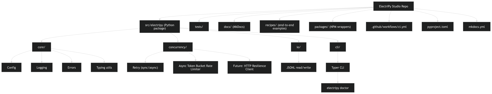
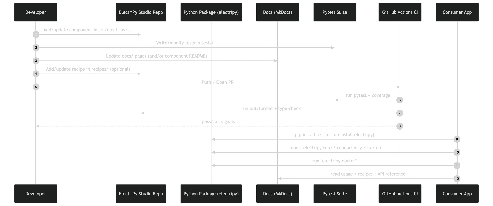

# ElectriPy Studio

Production-minded Python components and recipes (cookbook) by Inference Stack.

[](https://github.com/reactlabs-dev/electripy-studio/actions/workflows/ci.yml)
[](https://www.python.org/downloads/)
[](https://opensource.org/licenses/MIT)

## Overview

ElectriPy Studio is a curated collection of production-ready Python components and recipes designed to accelerate development while maintaining high code quality standards.

## Design principles

- Ports & Adapters: swap providers (LLMs, embedders, vector stores) without rewriting business logic.
- Deterministic by default: stable IDs and reproducible evaluation runs.
- Safe logging posture: avoid leaking prompts/responses; prefer hashes + redaction seams.
- Typed, production APIs: small public surfaces, strict typing, structured outputs where it matters.
- Testability: unit tests are offline and deterministic by default (no network required).

## Status & recent updates

- **Last updated**: 2026-03-04
- **Maturity**: Early alpha (APIs may still evolve), but core components, CLI, concurrency primitives, and first AI building blocks are in place.
- **Versioning**: SemVer begins at `v0.x` — expect breaking changes until `v1.0`.
- **Recent highlights**:
    - Added an LLM Gateway for provider-agnostic LLM calls with structured output and safety seams.
    - Added a RAG Evaluation Runner and `electripy rag eval` CLI for benchmarking retrieval quality over JSONL datasets.
    - Added an AI Telemetry component for safe, provider-agnostic observability across HTTP resilience, LLM gateway, policy decisions, and RAG evaluation.
    - Expanded documentation and user guides for core, concurrency, I/O, CLI, AI, and observability components.

## Features

- 🔧 **Core Components**: Configuration, logging, error handling, and type utilities
- ⚡ **Concurrency**: Retry mechanisms (sync/async) and async token bucket rate limiter
- 📁 **I/O**: JSONL read/write utilities for efficient data processing
- 💻 **CLI**: Typer-based command-line interface with health checks
- 🤖 **AI building blocks**: Provider-agnostic LLM Gateway with sync/async clients and structured-output helpers, plus a RAG Evaluation Runner for retrieval benchmarking.
- 📊 **AI Telemetry**: Provider-agnostic telemetry primitives and adapters (JSONL, optional OpenTelemetry) for HTTP resilience, LLM gateway, policy decisions, and RAG evaluation runs.

## Quick Start

### Using ElectriPy as a library

For most users, ElectriPy is just a Python library you depend on in your own project.

Once published to PyPI, you can install it directly:

```bash
pip install electripy
```

To work against a local clone in editable mode (e.g., to experiment with changes while using it in another project):

```bash
pip install -e .
```

For development on this repo itself (full tooling and test extras):

```bash
pip install -e ".[dev]"
```

### Verify Installation

```bash
electripy doctor
```

### Basic Usage

```python
from electripy import Config, get_logger
from electripy.concurrency import retry, AsyncTokenBucketRateLimiter
from electripy.io import read_jsonl, write_jsonl

# Configuration
config = Config.from_env()
logger = get_logger(__name__)

# Retry with exponential backoff
@retry(max_attempts=3, delay=1.0, backoff=2.0)
def fetch_data():
    return api_call()

# Rate limiting
limiter = AsyncTokenBucketRateLimiter(rate=10, capacity=10)
async with limiter:
    await rate_limited_operation()

# JSONL I/O
data = [{"id": 1, "name": "Alice"}, {"id": 2, "name": "Bob"}]
write_jsonl("output.jsonl", data)

for record in read_jsonl("output.jsonl"):
    print(record)
```

### AI quick start (LLM + RAG eval)

- Run a basic RAG evaluation over JSONL datasets:

```bash
electripy rag eval --corpus data/corpus.jsonl --queries data/queries.jsonl \
    --top-k 3,5,10 --report-json out/report.json
```

- LLM Gateway usage (offline-friendly fake provider example): see recipes/02_llm_gateway/.

## Documentation

Full documentation is available in the [docs/](docs/) directory:

- [Installation Guide](docs/getting-started/installation.md)
- [Quickstart](docs/getting-started/quickstart.md)
- [Core Concepts](docs/user-guide/core.md)
- [Concurrency & Resilience](docs/user-guide/concurrency.md)
- [I/O Utilities](docs/user-guide/io.md)
- [CLI Guide](docs/user-guide/cli.md)
- [LLM Gateway & AI](docs/user-guide/ai-llm-gateway.md)
- [AI Telemetry](src/electripy/observability/ai_telemetry/README.md)
- [RAG Evaluation Runner](src/electripy/ai/rag_eval_runner/README.md) (TODO: mirror this page into docs/user-guide/ai-rag-eval-runner.md)
- [Recipes](docs/recipes/cli-tool.md)
- [API Reference](docs/api.md)

Build and serve docs locally:

```bash
pip install -e ".[docs]"
mkdocs serve
```

## Visual Overview

### Repository Map



### Development Workflow



## Project Structure

```
electripy-studio/
├── src/electripy/          # Main package
│   ├── core/               # Config, logging, errors, typing
│   ├── concurrency/        # Retry & rate limiting
│   ├── io/                 # JSONL utilities
│   └── cli/                # CLI commands
│   └── ai/                 # AI building blocks (LLM + RAG)
│       ├── llm_gateway/    # Provider-agnostic LLM client + structured output helpers
│       └── rag_eval_runner/# Dataset + eval runner + CLI benchmarking
├── tests/                  # Test suite
├── docs/                   # Documentation
├── recipes/                # Example recipes
│   └── 01_cli_tool/        # CLI tool example
├── packages/               # NPM packages
│   └── electripy-cli/      # NPM CLI wrapper
├── pyproject.toml          # Project config
├── mkdocs.yml              # Docs config
└── LICENSE                 # MIT License
```

## Development

### Running Tests

```bash
pytest tests/ -v
```

With coverage:

```bash
pytest tests/ -v --cov=src --cov-report=term-missing
```

### Code Quality

```bash
# Linting
ruff check .

# Formatting
black .

# Type checking
mypy src/
```

### Python Tooling (recommended)

These tools are **optional but recommended for contributors** working on ElectriPy Studio itself. They are installed globally (via `pipx`) and then used inside whatever project or virtualenv you prefer.

#### 1. Install global CLI tools with pipx

`pipx` lets you install Python CLIs in isolated environments, so they don't conflict with your project dependencies:

```bash
python -m pip install --upgrade pip

brew install pipx      # or see https://pipx.pypa.io for other platforms
pipx ensurepath

pipx install uv        # fast Python package/dependency manager
pipx install poetry    # project/virtualenv manager (optional; this repo uses pyproject + hatchling)
pipx install ruff      # fast linter (also available via .[dev] extra)
pipx install pre-commit  # git pre-commit hooks runner
```

#### 2. Using uv (optional)

`uv` is a fast drop-in for many `pip`/`python -m venv` workflows. For example, to create a fresh environment for hacking on ElectriPy Studio:

```bash
uv venv .venv
source .venv/bin/activate

uv pip install -e ".[dev]"
```

You can also use `uv pip install electripy` in your own projects once the package is published.

#### 3. Using poetry in your own projects (optional)

This repo is built with `pyproject.toml` + Hatchling, but you can happily **consume** ElectriPy from a Poetry-managed project:

```bash
poetry add electripy
```

The library itself has no dependency on Poetry; it's just a convenient project manager if you already use it.

#### 4. pre-commit (for contributors)

Once `pre-commit` is installed, enable the hooks defined in [.pre-commit-config.yaml](.pre-commit-config.yaml):

```bash
pre-commit install
```

This will automatically run Black, Ruff, and basic whitespace checks on changed files before each commit.

### CI/CD

GitHub Actions automatically runs tests, linting, and type checking on all pull requests. See [.github/workflows/ci.yml](.github/workflows/ci.yml).

## Recipes

Check out the [recipes/](recipes/) directory for complete examples:

- [01_cli_tool](recipes/01_cli_tool/) - Building a production-ready CLI tool
- [02_llm_gateway](recipes/02_llm_gateway/) - LLM Gateway basics using a fake provider (offline-friendly)

## Requirements

- Python 3.11 or higher
- Dependencies managed via `pyproject.toml`

## License

MIT License - See [LICENSE](LICENSE) for details.

## Contributing

Contributions are welcome! Please ensure all tests pass and code quality checks succeed before submitting PRs.

## Links

- [GitHub Repository](https://github.com/reactlabs-dev/electripy-studio)
- [Documentation](docs/)
- [Issue Tracker](https://github.com/reactlabs-dev/electripy-studio/issues)
