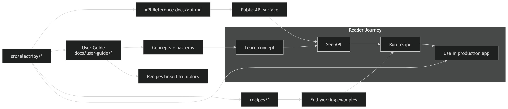

# ElectriPy Studio

**The Python substrate for observable agent engineering.**

## Overview

ElectriPy Studio is a curated collection of production-grade Python components for building observable, testable, and governable agent systems. It provides composable infrastructure for LLM routing, evaluation, policy enforcement, MCP integration, skills packaging, realtime session orchestration, and telemetry-aware runtime execution — all without adopting a framework.

> Import the pieces you need; leave the rest.

## Status

- **Maturity**: Early alpha — APIs may still evolve. Core components, agent infrastructure, and the full observability/governance/evaluation stack are implemented and tested.
- **Test suite**: 1,000+ offline, deterministic tests.
- **Versioning**: SemVer at `v0.x` — expect breaking changes until `v1.0`.

## Package map

### Agent infrastructure

| Package | Purpose |
|---------|---------|
| `llm_gateway` | Provider-agnostic sync/async LLM clients with request/response hooks |
| `provider_adapters` | OpenAI, Anthropic, Ollama, and generic HTTP-JSON adapters |
| `workload_router` | Cost/latency/capability-aware model routing |
| `fallback_chain` | Ranked provider failover with metadata tracking |
| `batch_complete` | Concurrent LLM fan-out with bounded concurrency |
| `structured_output` | Pydantic extraction from LLM text with auto-retry |
| `llm_cache` | Response caching (in-memory LRU, SQLite WAL) |
| `replay_tape` | Record, replay, and diff LLM interactions |

### Observability & governance

| Package | Purpose |
|---------|---------|
| `observe` | OpenTelemetry-aligned tracing with AI-specific span kinds |
| `telemetry` | Provider-agnostic telemetry adapters (JSONL, OpenTelemetry) |
| `policy` | Enterprise policy engine — rules, approval workflows, escalation chains |
| `policy_gateway` | Request/response guardrails with regex-based detection and multi-stage enforcement |
| `sensitive_data_scanner` | PII and secret detection with 9+ built-in patterns |

### Evaluation & quality

| Package | Purpose |
|---------|---------|
| `evals` | Dataset-driven evaluation with scoring and baseline comparison |
| `eval_assertions` | Pytest-native assertion helpers for LLM output validation |
| `rag_eval_runner` | Retrieval benchmarking with precision/recall/MRR metrics |

### Composition & packaging

| Package | Purpose |
|---------|---------|
| `skills` | Versioned skill packages with manifest-driven composition |
| `mcp` | Strongly typed Model Context Protocol toolkit |
| `prompt_engine` | Template composition and few-shot example management |
| `tool_registry` | Declarative tool definitions with JSON schema generation |

### Orchestration & runtime

| Package | Purpose |
|---------|---------|
| `realtime` | Session lifecycle — event sequencing, tool calls, interruption, backpressure |
| `agent_collaboration` | Bounded multi-agent handoff with hop limits and policy integration |
| `streaming_chat` | Sync/async stream chunk primitives |
| `agent_runtime` | Deterministic tool-plan execution |

### Core infrastructure

| Package | Purpose |
|---------|---------|
| `core` | Configuration, structured logging, error hierarchy |
| `concurrency` | Retry, rate limiting, circuit breaker |
| `io` | JSONL read/write utilities |
| `cli` | CLI commands, health checks, and demo showcase |

## Documentation map

## Quick links

### Getting started

- [Installation](getting-started/installation.md)
- [Quickstart Guide](getting-started/quickstart.md)

### Agent infrastructure

- [LLM Gateway](user-guide/ai-llm-gateway.md)
- [Provider Adapters](user-guide/ai-provider-adapters.md)
- [Workload Router](user-guide/ai-workload-router.md)
- [Fallback Chain](user-guide/ai-fallback-chain.md)
- [Batch Complete](user-guide/ai-batch-complete.md)
- [Structured Output](user-guide/ai-structured-output.md)
- [LLM Cache](user-guide/ai-llm-cache.md)
- [Replay Tape](user-guide/ai-replay-tape.md)

### Observability & governance

- [Observe — Structured Tracing](user-guide/ai-observe.md)
- [AI Telemetry](user-guide/ai-telemetry.md)
- [Policy Engine](user-guide/ai-policy.md)
- [Policy Gateway](user-guide/ai-policy-gateway.md)
- [Sensitive Data Scanner](user-guide/ai-sensitive-data-scanner.md)

### Evaluation & quality

- [Evals Framework](user-guide/ai-evals.md)
- [Eval Assertions](user-guide/ai-eval-assertions.md)
- [RAG Evaluation Runner](user-guide/ai-rag-eval-runner.md)

### Composition & packaging

- [Skills](user-guide/ai-skills.md)
- [MCP Toolkit](user-guide/ai-mcp.md)
- [Prompt Fingerprint](user-guide/ai-prompt-fingerprint.md)
- [JSON Repair](user-guide/ai-json-repair.md)

### Orchestration & runtime

- [Realtime Sessions](user-guide/ai-realtime.md)
- [Agent Collaboration](user-guide/ai-agent-collaboration.md)
- [Cost Ledger](user-guide/ai-cost-ledger.md)

### Foundation

- [Core Concepts](user-guide/core.md)
- [Concurrency & Resilience](user-guide/concurrency.md)
- [Circuit Breaker](user-guide/circuit-breaker.md)
- [I/O Utilities](user-guide/io.md)
- [CLI Guide](user-guide/cli.md)

### Reference

- [AI Product Engineering Overview](user-guide/ai-product-engineering.md)
- [Component Maturity Model](user-guide/component-maturity.md)
- [API Reference](api.md)

## Requirements

- Python 3.11 or higher
- Dependencies managed via `pyproject.toml`

## License

MIT License — see [LICENSE](https://github.com/inference-stack-llc/electripy-studio/blob/main/LICENSE) for details.
