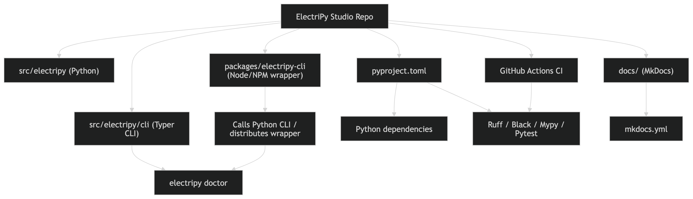

# CLI Module

Command-line interface built with Typer and Rich.

## Overview

ElectriPy provides a production-ready CLI with built-in health checks and diagnostics.



## Commands

### doctor

Check installation health and dependencies.

```bash
electripy doctor
```

Output includes:
- Python version check (requires 3.11+)
- ElectriPy version
- Configuration status
- Dependency verification

Example output:
```
ElectriPy Doctor
==================================================
Check                          Status          Details
Python Version                 ✓ OK           3.11.5
ElectriPy Version              ✓ OK           0.1.0
Configuration                  ✓ OK           Log level: INFO
typer package                  ✓ OK           0.9.0
rich package                   ✓ OK           13.5.0

✓ ElectriPy is ready to use!
```

### version

Display ElectriPy version.

```bash
electripy version
```

### rag eval (RAG Evaluation Runner)

Run retrieval-quality experiments over your own JSONL datasets.

```bash
electripy rag eval \
    --corpus corpus.jsonl \
    --queries queries.jsonl \
    --top-k 3,5,10 \
    --chunk-size 500 \
    --chunk-overlap 100 \
    --embedder fake \
    --report-json out.json \
    --report-csv out.csv
```

Key options:

- `--corpus`, `--queries`: JSONL files describing corpus and queries.
- `--top-k`: comma-separated list of cut-offs (for example `3,5,10`).
- `--chunk-size`, `--chunk-overlap` or `--chunker-config`: chunking configuration.
- `--embedder`: one or more embedders (for example `fake` or `fake,openai`).
- `--report-json`, `--report-csv`: write machine-readable evaluation reports.
- `--fail-under`: CI-friendly thresholds such as `hit_rate@5=0.85`.

### demo policy-collab

Run an offline end-to-end demo combining the **Policy Gateway**, **LLM Gateway** hooks, and **Agent Collaboration Runtime**.
No API keys or network required — uses fake adapters for deterministic output.

```bash
electripy demo policy-collab
```

Options:

- `--prompt, -p`: User prompt sent through the pipeline (default: `"Summarize for admin@example.com"`).
- `--max-hops`: Maximum agent handoffs before stopping (default: `12`).

Example with custom prompt:

```bash
electripy demo policy-collab --prompt "Alert user@corp.io about outage" --max-hops 6
```

The command prints a Rich table report showing:

- **Pipeline Summary** — user prompt, LLM response, collaboration status, hop count, telemetry events.
- **Agent Transcript** — each agent handoff with sender, receiver, and content.

### Global Options

- `--verbose, -v`: Enable verbose output
- `--help`: Show help message

## Extending the CLI

Create custom commands by extending the Typer app:

```python
from electripy.cli import app
import typer

@app.command()
def custom_command(
    name: str = typer.Option(..., help="Your name")
):
    """Custom command example."""
    typer.echo(f"Hello, {name}!")

if __name__ == "__main__":
    app()
```

## Using in Scripts

Import and use the CLI app programmatically:

```python
from typer.testing import CliRunner
from electripy.cli import app

runner = CliRunner()
result = runner.invoke(app, ["doctor"])
print(result.stdout)
```
